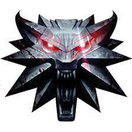
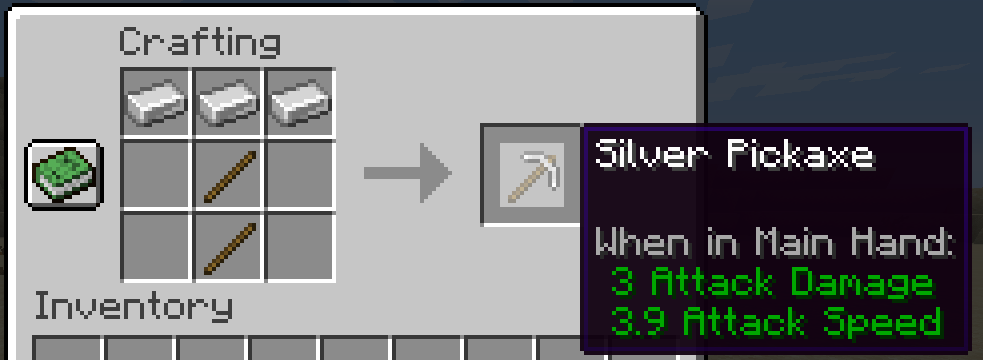
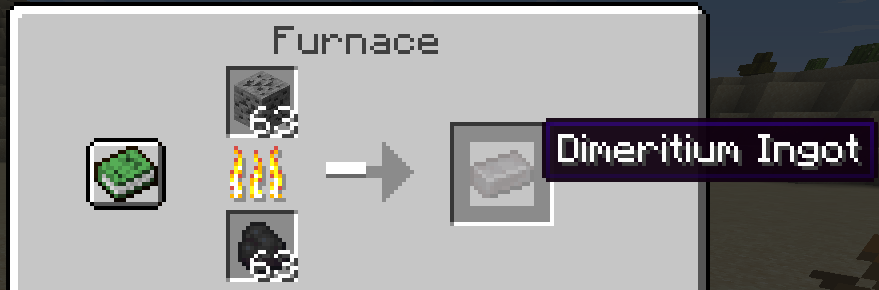
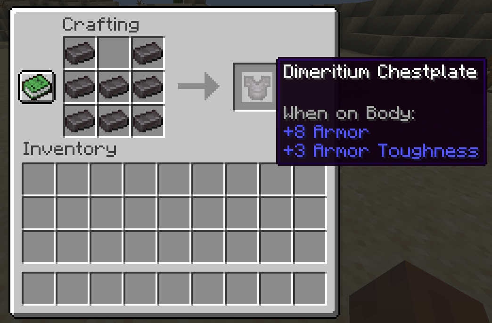
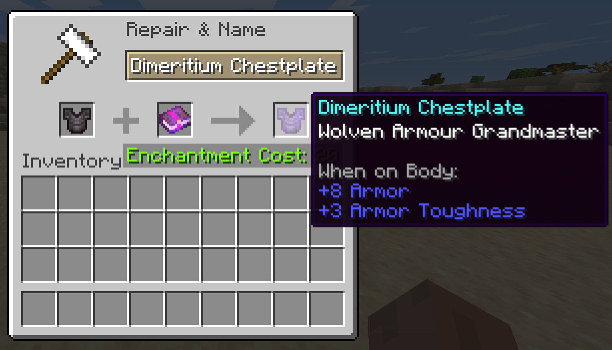
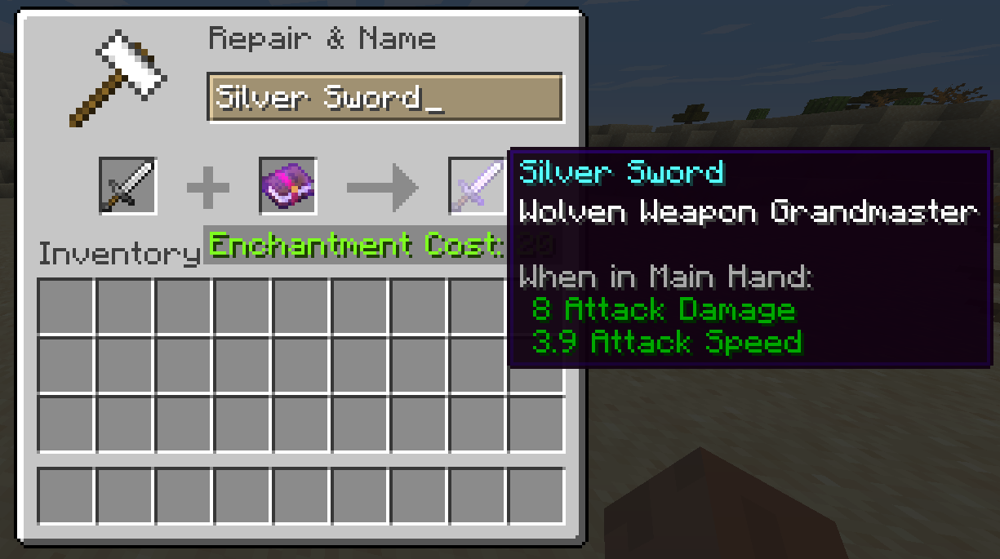

# WitcherOverhaul
Minecraft mod that adds gameplay features related to The Witcher series.

  

  
## Materials

This mod introduces the materials **silver** and **dimeritium** that can be used to create witcher gear and tools.

### Silver
**Silver Ore** is generated in the world and can be smelted in a furnace or blast furnace to obtain **silver ingots**.

**Silver ingots** may be used to craft all of the standard tools: pickaxe, sword, axe, shovel, and hoe.

### Dimeritium
**Dimeritium ore** is generated in the world and can be smelted in a furnace or blast furnace to obtain **dimeritium ingots**.

**Dimeritium ingots** may be used to craft all of the standard armour: helmet, chestplate, leggings, and boots.

## Enchanments

This mod introduces the **Wolven Armour** and **Wolven Weapon** enchantments, that increases protection from monsters and increases attack damage respectively. There are 5 levels for both of these enchanments (using the names from the Witcher 3 game).

Level | #1 | #2 | #3 | #4 | #5
--- | --- | --- | --- |--- |--- 
Name | Basic | Enhanced | Superior | Mastercrafted | Grandmaster

